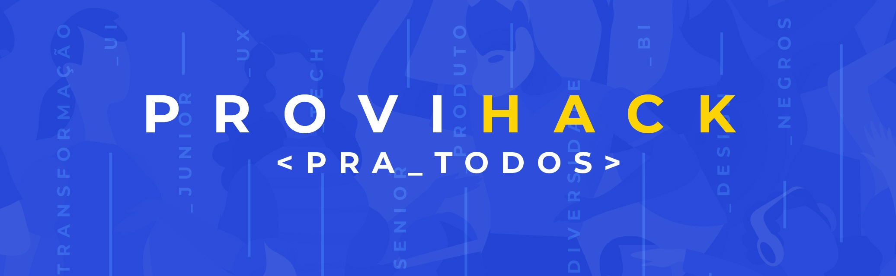
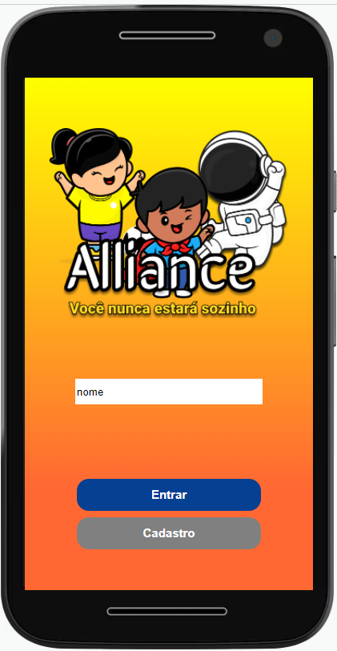

# ProviHack-Team-2

## Repositorio criando como parte do Hackathon promovido pela PROVI

### Tema: Como a tecnologia pode melhorar a vida de grupos diversos? ###

####   O app Alliance tem como publico alvo pessoas que tem TDAH, onde podemos identificar
#### que em sua maioria não utilizam nenhum tipo de tecnologia para auxiliar nesse ponto.
#### A monetização seria feita através da conexão entre paciente e profissional da área da
#### saúde e pela integração entre escola e paciente. As funcionalidade implementadas foram
#### estudos, raciocínio logico e To do (lista de tarefas). Com a possibilidade de pelo menos
#### mais 5 releases que ampliariam muito o potencial da ferramenta.

## [Link do Site](https://tdah-hacka.vercel.app/)

## Repository created as part of the Hackathon promoted by PROVI ##

### Topic: How can technology improve the lives of diverse groups? ###

Links de contribuintes para contato:

https://www.linkedin.com/in/rafael-leonardo-839516211/

https://www.linkedin.com/in/silvano-araujo-pereira-0616083b/

https://www.linkedin.com/in/-almeida/

